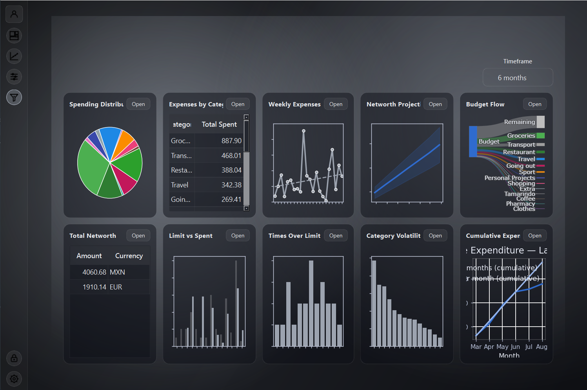

# 💰 Budget Tracker

A **lightweight personal finance and budgeting tool** to track **wallets, expenses, categories, and goals**, with built-in analytics, customizable UI, and a PySide6 Qt interface for displaying insights and net worth.

---


---

## 📑 Table of Contents

- [Overview](#overview)
- [Key Features](#key-features)
- [Architecture](#architecture)
- [Data & Database](#data--database)
- [Installation](#installation)
- [Usage](#usage)
- [Examples & Screenshots](#examples--screenshots)
- [Analytics & Reports](#analytics--reports)
- [Building a Windows exe](#building-a-windows-exe)
- [Roadmap](#roadmap)
- [Contributing](#contributing)
- [License](#license)
- [Acknowledgments](#acknowledgments)

---

## 📖 Overview

This project is a **personal budgeting and finance desktop app** built with **Python (PySide6, SQLite, Pandas, NumPy, Matplotlib, Plotly)**.  

It provides a full workflow:  

- **Track** wallet balances, expenses, categories, and goals.  
- **Visualize** net worth, monthly comparisons, and expenditure trends.  
- **Analyze** spending with descriptive statistics and drift detection.  
- **Customize** the UI with themes and palettes.  
- **Secure** data with login and password hashing.  
- **Import/Export** financial data via CSV, JSON, or Excel.  

The tool is designed to solve a real-world problem: **budgeting and financial discipline**, while also demonstrating end-to-end software engineering skills.  

---

## 🔑 Key Features

### 💸 Expenses
- Record expenses with `record_expense`.
- Undo expenses with `redo_expense`.
- Summaries by week/month.
- Descriptive statistics: mean, median, mode (by expense name).
- Category drift detection using confidence intervals.

### 💰 Wallets
- Manage multiple wallets (`get_all_wallets`, `get_wallet_by_id`, `order_by`).
- Transfer between wallets (`transfer_money`).
- Net worth per currency (`calc_networth(mode=1)`).
- Currency conversion support (`calc_networth(mode=2)` + API integration).

### 🎯 Goals
- Complete goals with `complete_goal`: deducts from wallet, logs as expense, deletes goal.
- Legacy compatibility with `ordeBy`.

### 📊 Analytics
- Weekly aggregates (`weekly_expenses`).
- Monthly comparisons (`month_comparasion`).
- Descriptive stats per month (`calc_descriptive_stats_per_month`).
- Trend detection: compare current vs. past periods.

### 🖥️ User Interface
- Built with **PySide6 (Qt)**.  
- Net worth displayed in a table widget grouped by currency.  
- Themed interface:  
  - Dark/Light modes.  
  - Seasonal palettes (e.g., summer, autumn).  

### 🔐 Security
- Login flow with password hashing.  
- Protects sensitive financial data.  

### 🔄 Import & Export
- Import/export in **CSV, JSON, and Excel**.  
- Easy backups and data portability.  

---

## 🏗️ Architecture

The project uses a **layered architecture** for clarity and maintainability:

main.py # Entry point
│
├── ui/ # Qt UI and windows
│ └── ...
│
├── backend/
│ ├── crud/ # Database CRUD (wallets, expenses, categories, goals)
│ │ ├── wallets.py
│ │ ├── expenses.py
│ │ ├── categories.py
│ │ └── goals.py
│ │
│ ├── high_level/ # Analytics & reporting
│ │ ├── analysis.py
│ │ └── reporting.py
│ │
│ └── db.py # SQLite connection handler
│
└── util/
└── config.py # App configuration, secrets, API keys


### Flow
1. **main.py** → initializes the program & UI.  
2. **UI Layer (ui/)** → handles windows & user interactions.  
3. **High-Level Layer (backend/high_level/)** → provides analytics, reporting, visualizations.  
4. **CRUD Layer (backend/crud/)** → raw database I/O.  
5. **Database Layer (db.py)** → manages SQLite persistence.  

This ensures a **clean separation of concerns** between presentation, logic, and storage.  

---

## 🗄️ Data & Database

- Uses **SQLite** for persistence.  
- Database schema defined in [`schema.sql`](schema.sql).  
- Supports multiple currencies.  

---

## ⚙️ Installation

### Prerequisites
- Python **3.11+**
- SQLite (bundled with Python stdlib)
- Virtual environment recommended

### Steps

git clone https://github.com/your-username/budget-tracker.git
cd budget-tracker

# Create a virtual environment
python -m venv .venv
source .venv/bin/activate   # Linux/macOS
.venv\Scripts\activate      # Windows

# Install dependencies
pip install -r requirements.txt


### Roadmap

Planned improvements and future features include:

- **Currency Conversion:**  
  Extend `calc_networth(mode=2)` to support automatic conversion between currencies using live exchange rates.  

- **Testing & CI:**  
  Add a test suite (e.g., with `pytest`) and configure continuous integration (e.g., GitHub Actions) to ensure reliability across updates.  

- **AI-Powered Analytics:**  
  Introduce AI/ML features for advanced insights, such as identifying unusual spending patterns, forecasting future expenses, and providing personalized recommendations.  

- **Enhanced UI:**  
  Expand beyond the current Qt table widget to include charts, dashboards, and richer visualizations of financial data.  

## Usage

After installation, run the application with:

python main.py
The main.py file starts the program and initializes the UI.

Common tasks
Record a new expense
from backend.high_level.analysis import record_expense
record_expense(
    name="Lunch",
    cost=12.50,
    date_str="2025-09-15",
    category_id=1,
    wallet_id=2,
    description="Sandwich and coffee"
)

Undo an expense
from backend.high_level.analysis import redo_expense
redo_expense(expense_id=10)
Calculate net worth per currency

from backend.high_level.analysis import calc_networth
print(calc_networth(mode=1))
# Example output: {'EUR': 200.0, 'USD': 150.0}

Display net worth in a Qt widget
from backend.high_level.analysis import networth_by_currency_table_qt
widget = networth_by_currency_table_qt()
widget.show()

## Examples & Screenshots

Below are example views and workflows of the application. Note the data shown is fictional for example purposes. 

### 1. Data analytics graphs
Visualizations including for weekly/monthly summaries and descriptive statistics (mean/median/mode).


---

### 2. Managing wallets
Create, edit, transfer between, and inspect wallet balances.


---

### 3. Profile view (import/export)
User profile and settings, with import/export features for backup and restore.


---

### 4. Overview / Dashboard
High-level summary showing net worth by currency, recent transactions, and active goals.


## Analytics & Reports

The application includes several functions to analyze financial data:

from backend.high_level.analysis import weekly_expenses
print(weekly_expenses(4))
# Example output: {'2025-W37': 120.50, '2025-W36': 98.20, '2025-W35': 140.00} 
Returns a dictionary of weekly totals for the last n weeks.

from backend.high_level.analysis import month_comparasion
print(month_comparasion())
# Example output: (450.0, 520.0, 70.0)
Compares expenses of the current month with the previous month

from backend.high_level.analysis import calc_descriptive_stats_per_month
print(calc_descriptive_stats_per_month("07-2025"))
# Example output: {'mean': 23.45, 'median': 19.99, 'mode': 'Coffee'}
Provides mean, median, and mode (most repeated expense name) for a given month.

## Building a Windows exe

To distribute the application as a standalone executable, use PyInstaller.

### one file build
pyinstaller --noconfirm --onefile main.py

### one folder build
pyinstaller --noconfirm --onedir main.py

Since the project already includes the necessary icon files, make sure to add them when building:
pyinstaller --noconfirm --onefile main.py \
  --add-data "path/to/icons;icons"

Replace path/to/icons with the correct relative path inside your project.
The ;icons part ensures the files are placed into an icons/ folder alongside the executable.


## Contributing

Contributions, issues, and feature requests are welcome!  

If you would like to contribute:  
1. Fork the repository.  
2. Create a new branch (`git checkout -b feature/your-feature`).  
3. Commit your changes with clear messages.  
4. Push to your branch (`git push origin feature/your-feature`).  
5. Open a Pull Request.  

Please ensure code follows PEP 8 style guidelines and includes meaningful docstrings.  


## License

This project is licensed under the MIT License.  
You are free to use, modify, and distribute this software, provided that the original copyright notice is included in all copies or substantial portions of the software.

See the [LICENSE](LICENSE) file for details.

### Acknowledgments

- [PySide6](https://wiki.qt.io/Qt_for_Python) for the Qt-based UI components.  
- [SQLite](https://www.sqlite.org/) for the lightweight, embedded database.  
- [Python](https://www.python.org/) for being the foundation of the project.  
- The open-source community for inspiration and best practices.  

```bash
